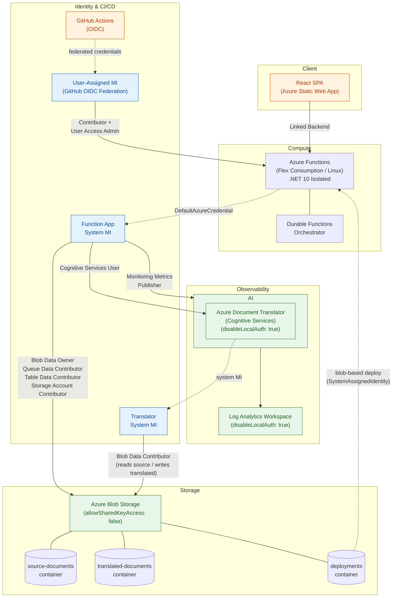

# Document Translation Reference Architecture

A reference implementation demonstrating scalable document translation on Azure
using Durable Functions fan-out/fan-in orchestration, batch splitting, and
Infrastructure-as-Code patterns. Designed for deployment into MCAPS external
tenants with all local authentication disabled and managed identity used
exclusively for service-to-service access.

## Architecture Overview

> Full detailed diagram with RBAC roles: [docs/architecture.md](docs/architecture.md)



All service-to-service communication uses **managed identity with RBAC** — no
API keys, connection strings, or SAS tokens.

### Key Patterns Demonstrated

- **Fan-out/Fan-in Orchestration**: Durable Functions orchestrator fans out
  translation work to per-batch activity functions and fans in results
- **Automatic Batch Splitting**: Transparently splits large uploads (>1,000
  files or >250 MB) into parallel batches respecting Azure Document Translation
  service limits
- **Infrastructure-as-Code**: All Azure resources defined in Bicep modules
  under `infra/`, deployable via Azure Developer CLI
- **Polling-based Status**: Frontend polls backend at 5-second intervals for
  translation progress updates
- **Zero Local Auth / MCAPS-Ready**: All services disable local authentication
  (shared keys, API keys, instrumentation keys). Every service-to-service
  connection uses system-assigned managed identity with least-privilege RBAC
- **Flex Consumption Plan**: Function App runs on the Flex Consumption SKU
  (Linux) with blob-based deployment, managed identity deployment auth, and
  auto-scaling up to 100 instances

## Quick Start

### Prerequisites

- [Azure Developer CLI (azd)](https://learn.microsoft.com/azure/developer/azure-developer-cli/install-azd)
- [.NET 10 SDK](https://dotnet.microsoft.com/download/dotnet/10.0)
- [Node.js 20+](https://nodejs.org/)
- [Azure CLI](https://learn.microsoft.com/cli/azure/install-azure-cli)
- An Azure subscription

### Deploy

```bash
# Clone the repository
git clone <repository-url>
cd document-translation-ref-arch

# Provision and deploy everything
azd up
```

### Tear Down

```bash
azd down
```

## Project Structure

```
├── azure.yaml              # azd manifest
├── infra/                   # Bicep IaC modules
│   ├── main.bicep           # Orchestrator
│   └── modules/             # Individual resource modules
├── src/
│   ├── api/                 # C# Azure Functions backend
│   │   ├── Functions/       # HTTP triggers + Durable orchestrator
│   │   ├── Models/          # Data model classes
│   │   └── Services/        # Blob storage + translation services
│   └── web/                 # React frontend
│       ├── src/components/  # UI components
│       ├── src/hooks/       # Custom React hooks
│       └── src/services/    # API client
└── .github/
    └── workflows/           # CI/CD pipelines
```

## API Endpoints

| Method | Route | Description |
|--------|-------|-------------|
| POST | `/api/translate` | Upload files and start translation |
| GET | `/api/translate/{sessionId}` | Get translation status |
| GET | `/api/translate/{sessionId}/download` | Download translated files |
| GET | `/api/languages` | List supported languages |

## Development

### Backend (Azure Functions)

```bash
cd src/api
dotnet restore
dotnet build
func start
```

### Frontend (React)

```bash
cd src/web
npm install
npm run dev
```

### Run Tests

```bash
# Backend tests
cd src/api
dotnet test DocumentTranslation.Api.Tests/

# Frontend tests
cd src/web
npm test
```

## Security Model

This reference architecture is designed for deployment into MCAPS external
tenants where local authentication must be disabled on all services:

| Service | Local Auth | Identity | RBAC Roles |
|---------|-----------|----------|------------|
| **Storage Account** | `allowSharedKeyAccess: false` | Function App system MI | Blob Data Owner, Blob Data Contributor, Queue Data Contributor, Table Data Contributor, Storage Account Contributor |
| | | Translator system MI | Blob Data Contributor (read source / write translated) |
| **Cognitive Services (Translator)** | `disableLocalAuth: true` | Function App system MI | Cognitive Services User |
| **Application Insights** | `DisableLocalAuth: true` | Function App system MI | Monitoring Metrics Publisher |
| **Log Analytics Workspace** | `disableLocalAuth: true` | — | — |
| **Function App** | SCM & FTP basic auth disabled | System-assigned MI | — |
| **GitHub Actions (CI/CD)** | OIDC federated credentials | User-assigned MI | Contributor, User Access Administrator |

- **No API keys or connection strings** are used in application code
- `BlobServiceClient` authenticates via `DefaultAzureCredential`
- `DocumentTranslationClient` authenticates via `DefaultAzureCredential`
- App Insights telemetry uses `Authorization=AAD` authentication
- Translator accesses blob storage via its own system MI (no SAS tokens)

## Architecture Decisions

See the [specs documentation](specs/001-doc-translation-ref-impl/) for detailed
architectural decisions, data model, API contracts, and research notes:

- [Feature Specification](specs/001-doc-translation-ref-impl/spec.md)
- [Implementation Plan](specs/001-doc-translation-ref-impl/plan.md)
- [Research & Decisions](specs/001-doc-translation-ref-impl/research.md)
- [Data Model](specs/001-doc-translation-ref-impl/data-model.md)
- [API Contract](specs/001-doc-translation-ref-impl/contracts/api.md)
- [Quick Start Guide](specs/001-doc-translation-ref-impl/quickstart.md)

## License

This project is a reference implementation for educational purposes.
