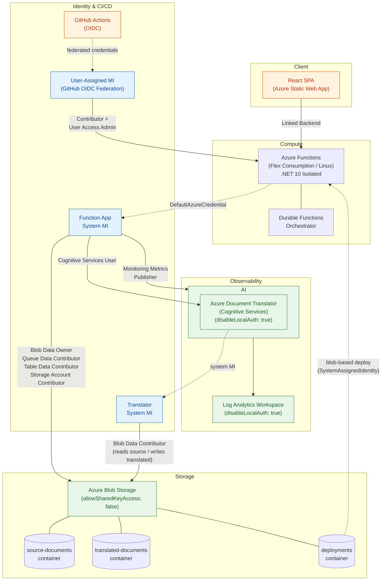

# Architecture Diagram

## Legend

- **Green nodes** — Services with local authentication disabled
- **Blue nodes** — Managed identities
- **Orange nodes** — Client-facing components (React SPA, GitHub Actions)
- **Solid labeled arrows** — RBAC role assignments (identity → service)
- **Dashed arrows** — Credential relationships (DefaultAzureCredential, OIDC federation, deployment auth)
