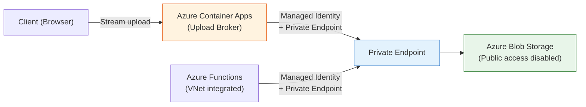

# Production Readiness Guide

This document maps the gaps between the current reference implementation and a production-ready system using the [Azure Well-Architected Framework](https://learn.microsoft.com/azure/well-architected/) (WAF) pillars. Each section identifies what would need to change and why.

For context on current limitations, see [Known Limitations](known-limitations.md). For the core pattern this architecture demonstrates, see [Core Scalability Pattern](scalability-pattern.md).

---

## Reliability

> *The ability of a system to recover from failures and continue to function.*

### Current State

The Durable Functions orchestrator provides basic reliability through checkpointing and a retry policy (3 attempts with exponential backoff). However, there is no handling beyond that for permanently failed translations, no health monitoring, and no multi-region redundancy.

### Recommendations

| Area | Recommendation |
|------|---------------|
| **Dead-letter handling** | Implement a dead-letter mechanism for batches that exhaust all retry attempts. Route permanently failed batches to a storage queue or table for manual review and re-submission rather than silently marking the session as failed. |
| **Health check endpoints** | Add health probes for the Function App and its dependencies (Blob Storage, Document Translation API). Use Azure Monitor or Azure Front Door health probes to detect and respond to outages. |
| **Compensation logic** | Implement compensation/rollback in the orchestrator for partial failures — e.g., if 2 of 5 batches fail, provide the option to retry only the failed batches rather than re-running the entire session. |
| **Session state durability** | Persist session metadata to an external store (e.g., Azure Cosmos DB or Azure SQL) in addition to the Durable Functions task hub. This provides queryable history and survives task hub purges. |
| **Multi-region deployment** | Deploy to multiple Azure regions with geo-redundant storage (GRS) and Azure Front Door for traffic routing and failover. |
| **Availability zones** | Enable availability zone redundancy for the Storage Account and the Function App hosting plan to survive single-zone failures. |

---

## Security

> *Protecting the application and its data from threats.*

### Current State

The reference implementation already disables local authentication on all services and uses managed identity with RBAC for all service-to-service communication. However, there is no user-facing authentication, no network isolation, and no abuse protection.

### Recommendations

| Area | Recommendation |
|------|---------------|
| **User authentication** | Integrate Microsoft Entra ID (Azure AD) authentication on all API endpoints. Replace `AuthorizationLevel.Anonymous` with Entra ID token validation. Use SWA's built-in auth providers or, in a production topology, Azure Front Door with Entra ID integration. |
| **Authorization & session ownership** | Implement authorization logic so users can only access their own translation sessions. Store the authenticated user's identity with each session and validate ownership on status and download requests. |
| **Web Application Firewall** | Deploy Azure Front Door with WAF policies to protect against OWASP Top 10 threats, bot traffic, and DDoS attacks. |
| **Network isolation** | Enable VNet integration for the Function App. Deploy private endpoints for the Storage Account and Cognitive Services. Disable public network access on both services entirely. All traffic between compute and data services should traverse the Azure backbone, not the public internet. |
| **Storage account — disable public access** | Disable public blob access on the storage account entirely. In the current implementation, the Document Translation API accesses blob storage via managed identity and RBAC — this works over private endpoints. For client file uploads, introduce an **API broker layer** (see below). |
| **API broker layer for uploads** | Deploy an **Azure Container Apps** service as an upload broker. The client streams files to the ACA endpoint, which forwards them to the private-endpoint-enabled storage account. ACA provides dynamic scaling to handle upload throughput without holding entire payloads in memory (streaming proxy). This eliminates the need for any public storage access or SAS tokens — the broker authenticates to storage via managed identity. |
| **Malware scanning** | Enable Microsoft Defender for Storage to scan uploaded documents for malware before translation processing begins. |
| **Rate limiting & throttling** | Implement rate limiting at the API layer (via API Management or application-level middleware) to prevent abuse and protect downstream services from overload. |
| **Content Security Policy** | Add CSP headers and other security response headers to the SWA configuration to mitigate XSS and data injection attacks. |

#### Recommended Upload Architecture with Network Isolation

In this topology:
- The **storage account has no public access** — all access is via private endpoints within the VNet.
- **Azure Container Apps** acts as a streaming upload proxy, accepting file uploads from clients and forwarding them to storage over the private endpoint. ACA scales dynamically based on upload traffic.
- The **Function App** connects to storage via VNet integration and private endpoints for orchestration and blob operations.
- The **Document Translation API** accesses storage via its system-assigned managed identity with RBAC — this works over private endpoints without SAS tokens.
- **No SAS tokens are used anywhere** — all authentication is via managed identity and RBAC, consistent with the existing security model.

---

## Cost Optimization

> *Managing costs to maximize the value delivered.*

### Current State

The Flex Consumption plan provides pay-per-execution pricing and scales to zero, which is cost-efficient for sporadic workloads. However, there are no lifecycle policies, budget controls, or right-sizing guidance.

### Recommendations

| Area | Recommendation |
|------|---------------|
| **Blob lifecycle management** | Configure Azure Storage lifecycle management policies to automatically delete source documents and translated output after a defined retention period (e.g., 30 days). Without this, storage costs grow unbounded over time. |
| **Translation API budgets** | Set up Azure Cost Management budgets and alerts specifically for the Cognitive Services (Document Translation) resource. Translation costs scale with document volume and can surprise without monitoring. |
| **Instance memory right-sizing** | The Function App is configured with 2,048 MB instance memory. Monitor actual memory usage with Application Insights and adjust downward if workloads consistently use less — this directly affects Flex Consumption billing. |
| **Maximum instance limits** | The current configuration allows up to 100 Function App instances. Set this based on actual peak load observations and the downstream capacity of the Document Translation API to avoid paying for unused scale. |
| **Task hub cleanup** | Implement periodic purging of completed Durable Functions orchestration history to control storage costs from the task hub tables and blobs. |

---

## Operational Excellence

> *Running and monitoring systems to deliver business value and continuously improve.*

### Current State

Application Insights is configured for telemetry with Entra ID-based authentication. However, there are no custom dashboards, alerts, structured correlation, or operational runbooks.

### Recommendations

| Area | Recommendation |
|------|---------------|
| **Structured logging with correlation** | Add correlation IDs that flow from the initial HTTP request through the orchestrator, batch activities, and translation API calls. Use Application Insights custom properties to enable end-to-end transaction tracing. |
| **Azure Monitor dashboards** | Create dashboards tracking key metrics: translation success/failure rates, batch processing duration, upload sizes, queue depth, Function App instance count, and memory utilization. |
| **Alerts** | Configure alert rules for: translation failure rate exceeding threshold, orchestration duration exceeding SLA, Function App memory utilization approaching limits, and Document Translation API throttling (429 responses). |
| **Deployment strategy** | Implement deployment slots or blue-green deployment patterns for zero-downtime deployments. The current `azd up` approach deploys directly to the production slot. |
| **Operational runbooks** | Document procedures for common operational scenarios: re-processing failed batches, purging stuck orchestrations, scaling up for anticipated load, rotating managed identity credentials, and disaster recovery. |
| **Load testing** | Use Azure Load Testing to validate the system's behavior under expected peak load. Test batch splitting boundaries, concurrent session handling, and memory consumption under load. |
| **CI/CD hardening** | Extend the existing GitHub Actions workflows with integration tests that exercise the full upload → translate → download flow in a staging environment before promoting to production. |

---

## Performance Efficiency

> *The ability of a system to adapt to changes in load.*

### Current State

The core fan-out/fan-in pattern scales well (see [Core Scalability Pattern](scalability-pattern.md)), but the surrounding infrastructure — upload handling, download/zip generation, and status updates — has bottlenecks that would fail under production load.

### Recommendations

| Area | Recommendation |
|------|---------------|
| **Streaming upload via API broker** | Replace the in-memory upload handling in `TranslateHttpTrigger` with a streaming upload architecture. Deploy an **Azure Container Apps** service as an upload broker that accepts chunked/streamed file uploads from clients and forwards them directly to Blob Storage via private endpoints. ACA provides dynamic per-request scaling without holding entire payloads in memory — and eliminates the need for public storage access. See the architecture diagram in the [Security section](#recommended-upload-architecture-with-network-isolation). |
| **Streaming or pre-built zip** | Replace the in-memory zip generation in `DownloadHttpTrigger` with either: (a) streaming zip generation using a library that writes zip entries directly to the HTTP response stream, or (b) pre-building the zip archive via a background job after translation completes, storing it as a blob, and serving it with a redirect. |
| **Real-time status updates** | Replace 5-second polling with WebSocket connections or Server-Sent Events (SSE) for push-based status updates. This eliminates unnecessary HTTP traffic and delivers sub-second status visibility. If using Azure Container Apps as the broker, it natively supports WebSocket connections. |
| **Language list caching** | Cache the supported languages list (currently fetched from the Translation API on every request) either in a distributed cache or as an in-memory cache with a reasonable TTL (e.g., 24 hours). The supported languages list changes infrequently. |
| **CDN / Front Door** | Deploy Azure Front Door or Azure CDN to serve the React SPA from edge locations globally, reducing latency for geographically distributed users. Front Door also provides SSL termination, WAF, and health-based routing. |
| **API Management** | Evaluate Azure API Management as the API gateway layer to provide request throttling, response caching, API versioning, request/response transformation, and developer portal capabilities. |

---

## Summary: Gap Analysis

| WAF Pillar | Current State | Key Production Gaps |
|------------|--------------|---------------------|
| **Reliability** | Durable Functions retry + checkpointing | No dead-letter, no health probes, single region, no external session store |
| **Security** | Managed identity + RBAC everywhere, local auth disabled | No user auth, no network isolation, public storage access, no WAF, no malware scanning |
| **Cost Optimization** | Flex Consumption (pay-per-use, scale to zero) | No blob lifecycle policies, no budget alerts, no right-sizing data |
| **Operational Excellence** | Application Insights telemetry | No dashboards, no alerts, no runbooks, no load testing |
| **Performance Efficiency** | Fan-out/fan-in with parallel batches | In-memory upload/download, polling-based status, no caching, no CDN |

---

## Further Reading

- [Azure Well-Architected Framework](https://learn.microsoft.com/azure/well-architected/)
- [Azure Well-Architected Review](https://learn.microsoft.com/assessments/azure-architecture-review/) — Interactive assessment tool
- [Azure Container Apps Overview](https://learn.microsoft.com/azure/container-apps/overview)
- [Azure Private Endpoints](https://learn.microsoft.com/azure/private-link/private-endpoint-overview)
- [Azure Front Door](https://learn.microsoft.com/azure/frontdoor/front-door-overview)
- [Microsoft Defender for Storage](https://learn.microsoft.com/azure/defender-for-cloud/defender-for-storage-introduction)
