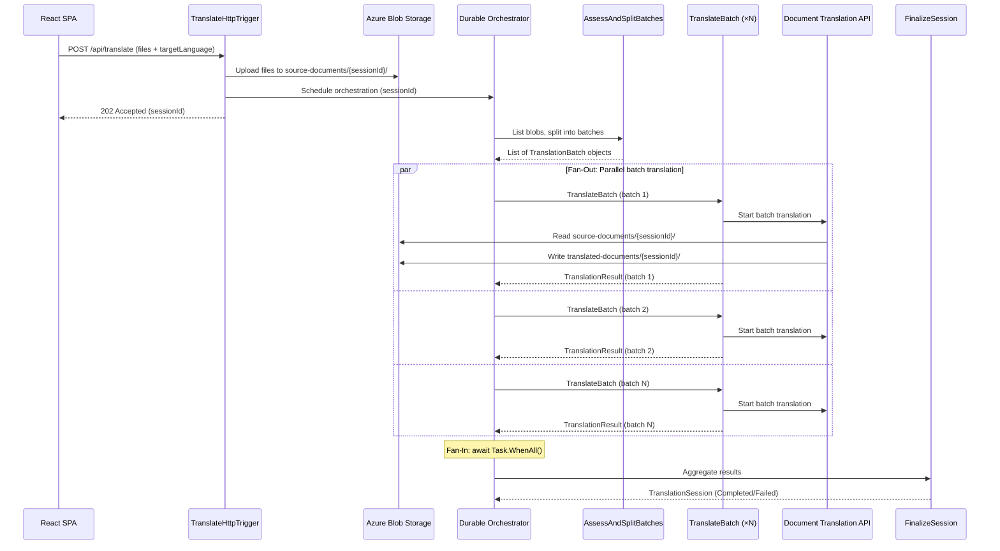

# Core Scalability Pattern: Durable Functions Fan-Out/Fan-In with Batch Document Translation

## Overview

The central scalability pattern in this reference architecture is the combination of **Azure Durable Functions fan-out/fan-in orchestration** with the **Azure Document Translation batch API**. Together, these two components enable the system to scale from a handful of documents to thousands — transparently splitting work into parallel batches that respect API service limits, with built-in retry, checkpointing, and fault tolerance provided by the Durable Functions runtime.

This pattern is the key takeaway from this reference implementation. The surrounding infrastructure (Static Web App, HTTP triggers, blob storage layout) exists to demonstrate the pattern in a working end-to-end system, but the orchestration logic is the piece designed to inform production architectures.

## How It Works

### End-to-End Flow



### Step 1: Batch Splitting — `AssessAndSplitBatches`

The Azure Document Translation API imposes per-request limits: a maximum of **1,000 documents** and **250 MB total size** per batch operation. The orchestrator's first activity function lists all uploaded blobs for the session and splits them into batches that respect both constraints simultaneously.

The splitting logic iterates through the document list, accumulating files into a batch until adding the next file would exceed either limit. At that point, it seals the current batch and starts a new one. This dual-constraint approach is defined by the constants:

- `TranslationBatch.MaxFilesPerBatch` = 1,000
- `TranslationBatch.MaxBytesPerBatch` = 250 MB (262,144,000 bytes)

A session with 2,500 files totaling 400 MB might produce three batches based on file count alone, or two batches based on size — the splitting algorithm handles whichever constraint is hit first.

### Step 2: Fan-Out — Parallel `TranslateBatch` Activities

Once batches are defined, the orchestrator fans out by launching a `TranslateBatch` activity function for **each batch in parallel**:

```csharp
var translationTasks = session.Batches.Select(batch =>
    context.CallActivityAsync<TranslationResult>(
        nameof(TranslateBatch),
        batch,
        retryOptions));

var results = await Task.WhenAll(translationTasks);
```

Each activity runs independently with a retry policy:

| Parameter | Value |
|-----------|-------|
| Max attempts | 3 |
| First retry interval | 5 seconds |
| Max retry interval | 5 minutes |
| Backoff coefficient | 2.0 |

This means a transient failure on one batch does not block or affect other batches. The Durable Functions runtime handles retry scheduling, and the orchestrator's state is automatically checkpointed between activity invocations — if the Function App restarts mid-execution, the orchestration resumes from its last checkpoint rather than re-executing completed work.

### Step 3: Document Translation API Integration

Each `TranslateBatch` activity invokes the Azure Document Translation batch API through `TranslationService`:

1. **`StartBatchTranslationAsync()`** — Constructs source and target container URIs with prefix scoping (e.g., `source-documents` container with prefix `{sessionId}/`) and submits the batch operation. The Translator service reads source documents directly from Blob Storage and writes translated output to the target container — the Function App never handles document content during translation.

2. **`WaitForTranslationAsync()`** — Polls the translation operation until completion, then collects per-document status including any error details for failed documents.

The Translator service authenticates to Blob Storage using its own **system-assigned managed identity** with the `Storage Blob Data Contributor` role — no SAS tokens or shared keys are involved.

### Step 4: Fan-In — `FinalizeSession`

After `Task.WhenAll()` completes (all batches finished or failed), the orchestrator calls `FinalizeSession` to aggregate results:

- If **all batches succeeded** → session status = `Completed`
- If **any batch failed** → session status = `Failed`, with per-batch error details preserved
- Error details from individual document failures are collected and surfaced in the session response

## Why This Pattern Scales

| Property | Mechanism |
|----------|-----------|
| **Parallel execution** | Each batch translates independently via `Task.WhenAll()` — adding more batches adds parallelism, not sequential time |
| **Automatic batch sizing** | Dual-constraint splitting ensures every batch stays within API limits regardless of upload size |
| **Checkpointing & replay** | Durable Functions automatically checkpoints orchestration state — survives Function App restarts, deployments, and transient infrastructure failures |
| **Built-in retry** | Configurable retry policy with exponential backoff handles transient API or network errors without custom retry loops |
| **Offloaded compute** | The Document Translation API is a fully managed Azure service — the Function App coordinates work but the actual translation compute is handled by Azure at scale |
| **Managed identity auth** | No token management, rotation, or expiry concerns — the Translator service accesses Blob Storage via its own system MI with RBAC |
| **Flex Consumption hosting** | The Function App runs on Azure Functions Flex Consumption plan, scaling from zero to 100 instances automatically based on load |

## Key Source Files

| File | Role |
|------|------|
| `src/api/Functions/TranslationOrchestrator.cs` | Durable orchestrator, batch splitting, fan-out/fan-in logic |
| `src/api/Services/TranslationService.cs` | Document Translation API client (start, wait, get languages) |
| `src/api/Models/TranslationBatch.cs` | Batch model with `MaxFilesPerBatch` / `MaxBytesPerBatch` constants |
| `src/api/Models/TranslationSession.cs` | Session model aggregating batches and overall status |
| `src/api/Functions/TranslateHttpTrigger.cs` | Entry point — uploads files, creates session, schedules orchestration |

## Further Reading

- [Azure Durable Functions — Fan-out/Fan-in Pattern](https://learn.microsoft.com/azure/azure-functions/durable/durable-functions-cloud-backup)
- [Azure Document Translation — Batch Translation](https://learn.microsoft.com/azure/ai-services/translator/document-translation/overview)
- [Architecture Diagram](architecture.md)
